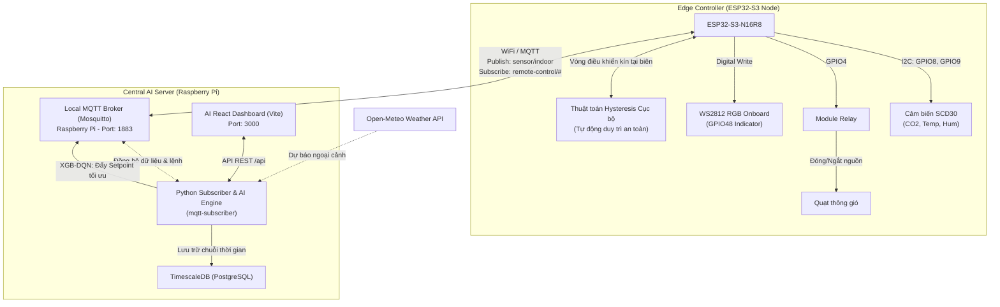

# 🌡️ Smart HVAC Control & AI Zone Manager System
### *Hệ thống điều khiển vi khí hậu và tối ưu hóa năng lượng thông minh sử dụng kiến trúc Phân tán Edge-to-Central (ESP32-S3 & Raspberry Pi Server & AI XGB-DQN)*

Dự án này là hệ thống điều khiển thông gió và điều hòa không khí thông minh (HVAC) cấp công nghiệp. Hệ thống được thiết kế theo mô hình **Hierarchical Control (Điều khiển phân tầng)**:
* **Edge Node (ESP32-S3):** Đảm nhận vai trò thu thập cảm biến chất lượng không khí cao cấp **Sensirion SCD30** (đo CO2, Nhiệt độ và Độ ẩm thực tế), đóng ngắt quạt thông gió qua **Module Relay**, chỉ thị làm mát/ấm bằng **LED** và duy trì **vòng điều khiển tự động cục bộ an toàn (Fail-safe)**.
* **Central Server (Raspberry Pi):** Đóng vai trò là **AI Zone Manager (Bộ điều phối và tối ưu hóa khu vực)** chạy trên nền tảng Docker, liên tục phân tích dữ liệu lịch sử lưu trữ trong **TimescaleDB**, chạy mô hình dự báo **XGB-DQN** kết hợp thời tiết để tự động hiệu chỉnh tối ưu các tham số vận hành cho ESP32.

---

## 🏗️ 1. Sơ đồ kiến trúc Phân tầng (System Architecture)

Sự phối hợp hoàn hảo giữa năng lực tính toán AI vĩ mô của **Raspberry Pi** và khả năng đáp ứng thời gian thực ổn định ở biên của **ESP32**:



---

## 🧠 2. Các tính năng thông minh của AI Zone Manager trên Pi

Không trực tiếp can thiệp vào các rơ-le vật lý để tránh rủi ro mất mạng, Raspberry Pi đóng vai trò là **Tổng tư lệnh** hiệu chỉnh các tham số vận hành của ESP32 thông qua 3 tính năng cốt lõi:

### 💼 A. Hệ thống quản lý chính sách theo lịch trình (Zone Policy Engine)
AI Zone Manager tự động điều phối trạng thái phòng dựa theo thời gian thực trên Pi:
* **Chính sách giờ làm việc (08:00 - 17:00):** Tự động áp đặt nhiệt độ setpoint dễ chịu ($24.5^\circ\text{C}$), quạt chạy tự động bảo vệ sức khỏe nhân viên.
* **Chính sách ngủ đêm ECO (22:00 - 06:00):** Tăng nhiệt độ setpoint lên $26.5^\circ\text{C}$ để tiết kiệm điện, đồng thời ra lệnh giảm tốc độ quạt tránh ồn khi ngủ.
* **Chính sách chờ cực hạn (Eco Standby):** Ngoài giờ làm việc, tự động ra lệnh tắt nguồn hệ thống để triệt tiêu năng lượng hao phí.

### 🍃 B. Thuật toán thích ứng thời tiết XGB-DQN (Free Cooling)
* Pi liên tục thu thập nhiệt độ ngoài trời từ API thời tiết. 
* Nếu nhiệt độ ngoài trời mát hơn nhiệt độ phòng hiện tại $> 1.5^\circ\text{C}$, AI sẽ phát hiện cơ hội **Làm mát tự nhiên**.
* Pi tự động gửi lệnh tăng setpoint điều hòa lên $28^\circ\text{C}$ (để khóa block làm mát tốn điện) và điều khiển quạt thông gió chạy ở tốc độ cao, đồng thời hiển thị khuyến nghị trên Dashboard: *“Hãy mở cửa sổ để nhận gió tự nhiên”*.

### 👤 C. Cơ chế ghi đè thủ công thông minh (Manual Override)
* Nhằm tôn trọng tuyệt đối trải nghiệm người dùng, khi bạn thay đổi nhiệt độ hoặc bật/tắt thiết bị trên Dashboard, Pi sẽ **tự động tạm dừng kiểm soát của AI trong 15 phút**.
* Màn hình sẽ hiển thị trạng thái `CHỈNH TAY (OVERRIDE)` kèm đồng hồ đếm ngược. Sau 15 phút, Pi sẽ tự động hoàn trả quyền điều khiển về cho AI.

---

## 🎛️ 3. Ba chế độ vận hành trên Dashboard

Giao diện React Dashboard mới cung cấp cái nhìn toàn diện và 3 chế độ hoạt động:
1. **Chế độ Thủ công (Manual):** Người dùng có quyền quyết định 100%. Mọi lệnh thay đổi setpoint được gửi thẳng xuống thiết bị.
2. **Chế độ Tự động cơ bản (Classic Auto):** ESP32 tự hoạt động dựa trên các ngưỡng cứng mặc định cài sẵn trong firmware mà không cần máy chủ AI hỗ trợ.
3. **Chế độ Tự động thông minh (AI Smart Auto - AI Mode):** Kích hoạt bộ não AI trên Raspberry Pi thực hiện phân tích XGB-DQN và tối ưu hóa động.

---

## 📌 4. Sơ đồ kết nối phần cứng (Wiring Diagram)

> [!IMPORTANT]
> Hãy ngắt tất cả nguồn điện cấp cho ESP32-S3 trước khi thực hiện cắm dây để bảo vệ các cổng GPIO nhạy cảm.

### 🔌 A. Cảm biến SCD30 với ESP32-S3 (Giao tiếp I2C)
| Chân SCD30 | Chân ESP32-S3 | Chức năng | Màu dây đề xuất |
| :--- | :--- | :--- | :--- |
| **VIN** | **3V3** | Cấp nguồn 3.3V | Đỏ |
| **GND** | **GND** | Đất chung | Đen |
| **SDA** | **GPIO8** | Đường truyền dữ liệu I2C SDA | Vàng |
| **SCL** | **GPIO9** | Đường truyền xung nhịp I2C SCL | Cam |

### 🎛️ B. Module Relay với ESP32-S3
| Chân Relay | Chân ESP32-S3 / Nguồn | Chức năng |
| :--- | :--- | :--- |
| **VCC** | **5V** (hoặc nguồn ngoài 5V) | Cấp nguồn cho cuộn hút của Relay |
| **GND** | **GND** | Đất chung |
| **IN1** | **GPIO4** | Tín hiệu điều khiển Quạt (Mức kích: HIGH) |

### 🌀 C. Đấu nối nguồn Quạt thông gió với Relay (2 Phương án)
Relay hoạt động như một công tắc cơ học (tiếp điểm khô). Bạn có thể chọn 1 trong 2 cách đấu nối mạch động lực cho quạt dưới đây (Khuyên dùng **Phương án 1** theo tiêu chuẩn thiết kế điện công nghiệp):

#### 👉 Phương án 1: Đóng/Ngắt đường dây Dương (+) của nguồn quạt (Khuyên dùng)
* Dây **Âm (-)** của nguồn quạt $\rightarrow$ Nối **trực tiếp** vào dây **Âm (-)** của Quạt.
* Dây **Dương (+)** của nguồn quạt $\rightarrow$ Nối vào chân **COM** của Relay.
* Chân **NO** của Relay $\rightarrow$ Nối vào dây **Dương (+)** của Quạt.
```text
[ Nguồn Quạt - ] ───────────────────────────> [ Quạt - ] (Nối trực tiếp)

[ Nguồn Quạt + ] ────────> [ Cổng COM ]
                            [ Cổng NO  ] ───> [ Quạt + ]
```

#### 👉 Phương án 2: Đóng/Ngắt đường dây Âm (-) của nguồn quạt
* Dây **Dương (+)** của nguồn quạt $\rightarrow$ Nối **trực tiếp** vào dây **Dương (+)** của Quạt.
* Dây **Âm (-)** của nguồn quạt $\rightarrow$ Nối vào chân **COM** của Relay.
* Chân **NO** của Relay $\rightarrow$ Nối vào dây **Âm (-)** của Quạt.
```text
[ Nguồn Quạt + ] ───────────────────────────> [ Quạt + ] (Nối trực tiếp)

[ Nguồn Quạt - ] ────────> [ Cổng COM ]
                            [ Cổng NO  ] ───> [ Quạt - ]
```

---

## ⚙️ 5. Hướng dẫn nạp Firmware cho ESP32

Mở file **`HVAC_Control.ino`** bằng Arduino IDE:
1. Đảm bảo khai báo đúng mạng WiFi tại khu vực của bạn:
   ```cpp
   #define WIFI_SSID        "Ten_Wifi_Cua_Ban"
   #define WIFI_PASSWORD    "Mat_Khau_Wifi"
   ```
2. Trỏ địa chỉ máy chủ MQTT về IP tĩnh của Raspberry Pi trong mạng cục bộ:
   ```cpp
   #define MQTT_SERVER      "192.168.1.100" // IP tĩnh của Raspberry Pi
   #define MQTT_PORT        1883
   ```
3. Nạp code cho mạch **ESP32-S3 Dev Module** và giám sát qua Serial Monitor (Baudrate: `115200`).

---

## 🚀 6. Hướng dẫn Triển khai trên Raspberry Pi (Central Server)

Dự án đã được đóng gói hoàn toàn bằng Docker Compose, giúp việc triển khai trên Pi cực kỳ nhanh chóng:

### Bước 1: Cài đặt Docker trên Raspberry Pi
Chạy lệnh sau trên terminal SSH của Raspberry Pi:
```bash
curl -sSL https://get.docker.com | sh
sudo usermod -aG docker $USER
sudo reboot
```

### Bước 2: Dọn dẹp cổng trùng lặp trên Pi
Do Pi thường chạy sẵn dịch vụ Mosquitto cục bộ trùng cổng `1883` với Docker, hãy tắt và vô hiệu hóa nó:
```bash
sudo systemctl stop mosquitto
sudo systemctl disable mosquitto
```

### Bước 3: Khởi chạy cụm dịch vụ bằng Docker Compose
Truy cập vào thư mục chứa mã nguồn dự án trên Pi (`Smart_HVAC`) và chạy lệnh:
```bash
sudo docker compose up -d --build
```
Lệnh này sẽ tự động tải các Image, biên dịch mã nguồn Python/Vite React và chạy ngầm 4 dịch vụ:
* `mosquitto` (MQTT Broker - Cổng 1883)
* `timescaledb` (Cơ sở dữ liệu chuỗi thời gian PostgreSQL - Cổng 5432)
* `mqtt-subscriber` (Bộ điều khiển AI và API Python - Cổng 5000)
* `smart_hvac-app-1` (Giao diện Web UI React - Cổng 3000)

### Bước 4: Kiểm tra log hoạt động của AI
Bạn có thể giám sát quá trình nhận dữ liệu cảm biến và tính toán tối ưu setpoint của AI bằng cách xem logs:
```bash
sudo docker logs -f mqtt-subscriber
```

---

## 🖥️ 7. Hướng dẫn Truy cập & Vận hành Dashboard

Sau khi khởi chạy Docker thành công trên Raspberry Pi (hoặc máy tính của bạn), giao diện web điều khiển trực quan đã sẵn sàng để truy cập.

### 🔗 A. Địa chỉ truy cập Dashboard
Hãy mở bất kỳ trình duyệt web nào (Chrome, Safari, Edge, Firefox...) và truy cập theo địa chỉ sau:

* **Nếu bạn mở trình duyệt ngay trên máy đang chạy Docker:**
  ```text
  http://localhost:3000
  ```
* **Nếu bạn mở từ thiết bị khác trong cùng mạng WiFi (Máy tính khác, Điện thoại, Máy tính bảng):**
  Truy cập qua IP mạng cục bộ của máy chủ (ví dụ IP Raspberry Pi của bạn là `10.136.101.169`):
  ```text
  http://10.136.101.169:3000
  ```

---

### 🎨 B. Cách vận hành & Đọc giao diện Dashboard

Giao diện Dashboard được nâng cấp động gồm các phân vùng chức năng thông minh sau:

#### 1. Chỉ số cảm biến thời gian thực (Metrics Grid):
* Hiển thị chi tiết 4 thông số đo từ cảm biến SCD30: **Nhiệt độ phòng**, **Độ ẩm**, **Nồng độ CO2** và **Bụi mịn (PM2.5)**.
* Chỉ số sẽ tự động cập nhật và thay đổi màu sắc trạng thái: **Xanh lá** (Tốt), **Vàng** (Cảnh báo), **Đỏ** (Nguy hiểm).

#### 2. Trợ lý AI điều phối (AI Zone Coordinator Widget):
Đây là bộ não hiển thị trạng thái của Pi nằm ở góc dưới bên trái của Dashboard:
* **Badge Trạng thái động:**
  * `AI ĐANG TỐI ƯU` (Màu xanh nhấp nháy): Biểu thị mô hình XGB-DQN trên Pi đang làm chủ hệ thống, tự động điều phối setpoint.
  * `CHỈNH TAY (OVERRIDE)` (Màu cam kèm đồng hồ đếm ngược): Xuất hiện khi bạn chủ động thay đổi nút bấm, AI sẽ tạm thời nhường quyền quyết định cho bạn trong 15 phút.
* **Chính sách hiện tại:** Cho biết Pi đang áp dụng chính sách thời gian nào (💼 Giờ làm việc, 🌙 Ngủ đêm ECO, 🍃 Chờ tiết kiệm).
* **Khuyến nghị từ AI:** Hộp thoại hiển thị phân tích thông minh thời gian thực (Ví dụ: *"AI phát hiện trời mát ngoài trời (24.0°C). Khuyến nghị mở cửa sổ để làm mát tự nhiên!"*).

#### 3. Bảng điều khiển thủ công (Control Panel):
* Nằm ở cột bên phải, cho phép bạn bật/tắt nguồn hệ thống, điều chỉnh chế độ hoạt động (Auto/Cool/Heat) và trượt thanh kéo để chỉnh nhiệt độ mục tiêu.
* **Lưu ý:** Khi bạn thao tác tại bảng này, hệ thống sẽ lập tức chuyển sang chế độ `Manual Override` trong 15 phút để đảm bảo ưu tiên tuyệt đối cho mong muốn của bạn.

---

## 🛠️ 8. Hướng dẫn xử lý sự cố thường gặp (Troubleshooting)

### 🔴 Lỗi 1: `Bind for 0.0.0.0:1883 failed: port is already allocated` khi chạy docker
* **Nguyên nhân:** Dịch vụ Mosquitto cài trực tiếp trên hệ điều hành của Pi đang chiếm cổng `1883`.
* **Khắc phục:** Chạy lệnh `sudo systemctl stop mosquitto` trên Pi trước khi khởi chạy Docker Compose.

### 🔴 Lỗi 2: ESP32 không thể gửi dữ liệu lên Pi (báo lỗi MQTT connect failed liên tục)
* **Nguyên nhân:** ESP32 và Pi không ở chung mạng WiFi cục bộ, hoặc IP của Pi đã bị thay đổi bởi Router.
* **Khắc phục:** 
  1. Đảm bảo cả ESP32 và Pi đều bắt chung 1 mạng WiFi.
  2. Thiết lập cấu hình IP tĩnh cho Raspberry Pi trên thiết bị Router của bạn để IP không bị thay đổi.
  3. Kiểm tra tường lửa trên Pi có chặn cổng 1883 không bằng lệnh: `sudo ufw allow 1883/tcp`.

---
*Dự án được xây dựng và phát triển trên nền tảng khoa học tối ưu hóa công trình và môi trường. Chúc bạn có những trải nghiệm tuyệt vời với hệ thống HVAC thông minh của mình!*
