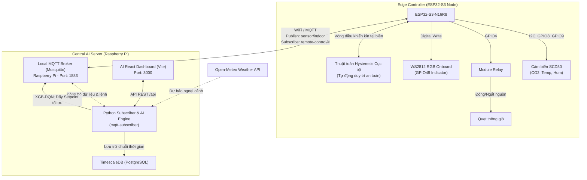

# 🌡️ Smart HVAC Control & AI Zone Manager System
### *Hệ thống điều khiển vi khí hậu và tối ưu hóa năng lượng thông minh sử dụng kiến trúc Phân tán Edge-to-Central (ESP32-S3 & Raspberry Pi Server & AI XGB-DQN)*

Dự án này là hệ thống điều khiển thông gió và điều hòa không khí thông minh (HVAC) cấp công nghiệp. Hệ thống được thiết kế theo mô hình **Hierarchical Control (Điều khiển phân tầng)**:
* **Edge Node (ESP32-S3):** Đảm nhận vai trò thu thập cảm biến chất lượng không khí cao cấp **Sensirion SCD30** (đo CO2, Nhiệt độ và Độ ẩm thực tế), đóng ngắt quạt thông gió qua **Module Relay**, chỉ thị làm mát/ấm bằng **LED** và duy trì **vòng điều khiển tự động cục bộ an toàn (Fail-safe)** dựa trên các ngưỡng an toàn tối ưu được đẩy xuống từ Pi.
* **Central Server (Raspberry Pi):** Đóng vai trò là **AI Zone Manager (Bộ điều phối và tối ưu hóa khu vực)** chạy trên nền tảng Docker, liên tục phân tích dữ liệu lịch sử lưu trữ trong **TimescaleDB**, chạy mô hình dự báo **XGB-DQN** kết hợp thời tiết để tự động hiệu chỉnh tối ưu các tham số vận hành cho ESP32.

---

## 🏗️ 1. Sơ đồ kiến trúc Phân tầng (System Architecture)

Sự phối hợp hoàn hảo giữa năng lực tính toán AI vĩ mô của **Raspberry Pi** và khả năng đáp ứng thời gian thực ổn định ở biên của **ESP32**:



---

## 🧠 2. Các tính năng thông minh của AI Zone Manager trên Pi

Không trực tiếp can thiệp vào các rơ-le vật lý để tránh rủi ro mất mạng, Raspberry Pi đóng vai trò là **Tổng tư lệnh** hiệu chỉnh các tham số vận hành của ESP32 thông qua các tính năng cốt lõi:

### 💼 A. Hệ thống quản lý chính sách theo lịch trình (Zone Policy Engine)
AI Zone Manager tự động điều phối trạng thái phòng dựa theo thời gian thực trên Pi:
* **Chính sách giờ làm việc (08:00 - 17:00):** Tự động duy trì setpoint mát dễ chịu ($24.5^\circ\text{C}$), tối ưu hóa CO2 nghiêm ngặt ở mức thấp ($700\text{ ppm}$) giúp đầu óc tỉnh táo và làm việc hiệu quả.
* **Chính sách ngủ đêm ECO (22:00 - 06:00):** Tăng nhiệt độ lên $26.5^\circ\text{C}$ để tiết kiệm điện, ra lệnh quạt thông gió chạy ở mức Low/Auto với ngưỡng CO2 nâng lên $950\text{ ppm}$ để tránh quạt đóng ngắt liên tục gây ồn khi ngủ.
* **Chính sách chờ cực hạn (Eco Standby):** Ngoài giờ làm việc, tự động tắt nguồn điều hòa và nâng ngưỡng an toàn thông gió lên tối đa ($1200\text{ ppm}$ / $75\%$) để đưa căn phòng về chế độ ngủ đông siêu tiết kiệm điện.

### 🍃 B. Thuật toán thích ứng thời tiết XGB-DQN (Free Cooling)
* Pi liên tục thu thập nhiệt độ ngoài trời từ API thời tiết. 
* Nếu nhiệt độ ngoài trời mát hơn nhiệt độ phòng hiện tại $> 1.5^\circ\text{C}$, AI sẽ phát hiện cơ hội **Làm mát tự nhiên**.
* Pi tự động gửi lệnh tăng setpoint điều hòa lên $28^\circ\text{C}$ (để khóa block làm mát tốn điện) và điều khiển quạt thông gió chạy ở tốc độ cao, đồng thời hiển thị khuyến nghị trên Dashboard: *“Hãy mở cửa sổ để nhận gió tự nhiên”*.

### 👤 C. Cơ chế ghi đè thủ công thông minh (Manual Override)
* Nhằm tôn trọng tuyệt đối trải nghiệm người dùng, khi bạn thay đổi nhiệt độ hoặc bật/tắt thiết bị trên Dashboard, Pi sẽ **tự động tạm dừng kiểm soát của AI trong 15 phút**.
* Màn hình sẽ hiển thị trạng thái `CHỈNH TAY (OVERRIDE)` kèm đồng hồ đếm ngược. Sau 15 phút, Pi sẽ tự động hoàn trả quyền điều khiển về cho AI.

### ⚡ D. Thuật toán mô phỏng điện năng thực tế & So sánh Baseline
Để trực quan hóa hiệu quả kinh tế mà bộ não AI mang lại, server tích hợp một mô hình **Thermodynamic Physical Simulation** và đối chiếu song song với hệ thống **Baseline truyền thống**:
* **Phân rã tiêu thụ (AI Breakdown):** Tách bạch công suất tức thời đang tiêu thụ của:
  * *Điều hòa (AC Unit):* Tiêu thụ từ `0W` (chờ), `12W` (quạt dàn lạnh), `150W` (inverter chạy duy trì), cho tới `1400W` (máy nén chạy hết tải làm lạnh nhanh).
  * *Quạt gió (Fan):* Tiêu thụ `45W` khi quạt hoạt động.
  * *Hệ thống (Standby):* Tiêu thụ cố định `5W`.
* **Hệ thống Baseline truyền thống (Traditional Setup):** Mô phỏng một căn phòng vận hành thủ công không tối ưu:
  * Máy lạnh bật liên tục 24/7 cố định ở mức nhiệt độ lạnh buốt `24.0°C` (không có chính sách standby hay ngủ đêm).
  * Quạt thông gió bật liên tục 100% thời gian (`45W`) không tối ưu theo nồng độ khí.
* **Tỷ lệ tiết kiệm của AI (AI Savings %):** Tích lũy lượng điện năng tiêu thụ (kWh) của 2 hệ thống và tính toán trực tiếp tỷ số phần trăm năng lượng đã tiết kiệm được:
  $$\% \text{ Tiết kiệm} = \frac{E_{baseline} - E_{AI}}{E_{baseline}} \times 100\%$$
* **Quy đổi Chi phí (VNĐ) & CO2:** Tự động quy đổi năng lượng giảm thiểu ra chi phí tiền điện thực tế ở Việt Nam (~`2500 VNĐ / kWh`) và lượng giảm phát thải Carbon Dioxide nhà kính (`1 kWh ~ 0.5 kg CO2`).

---

## 🖥️ 3. Giao diện Tập trung Năng lượng & AI của Dashboard

Giao diện Web React Dashboard được thiết kế theo phong cách hiện đại và State-of-the-Art, tập trung tối đa vào phân tích AI và tối ưu hóa điện năng:

1. **Biểu đồ Công suất thời gian thực (Real-time Power Load Chart):** 
   - Thay thế biểu đồ thời tiết cũ bằng một Area Chart cỡ lớn biểu diễn song song: **Công suất AI tối ưu (Xanh dương - W)** và **Công suất Baseline truyền thống (Đỏ - W)**.
   - Cho phép người dùng nhìn thấy trực tiếp độ lệch tải công suất giữa hai hệ thống theo từng giây.
2. **Bảng Phân tích Hiệu quả AI (AI Savings Coordinator):**
   - Nằm ở khu vực trung tâm dưới biểu đồ, hiển thị **Badge xanh lá lấp lánh biểu thị tỷ lệ tiết kiệm điện (X.X%)**.
   - Cung cấp số tiền điện đã giảm (VNĐ) và số lượng khí thải CO2 đã giảm thiểu.
   - Bảng đối chiếu chi tiết kWh/VNĐ side-by-side giữa hai hệ thống cùng hộp thoại khuyến nghị thời gian thực từ Pi.
3. **Hộp thoại Điện năng tiêu thụ (AI Simulator):**
   - Hiển thị công suất tức thời hiện tại (W/kW) đi kèm badge phân tích mức tải thông minh (Chờ/Tiết kiệm, Tải trung bình, Tải cao).
   - Tích hợp biểu đồ Sparkline mini vẽ lịch sử tải của 7 chu kỳ telemetry gần nhất.
4. **Thẻ Ngưỡng Tự động AI (Read-Only AI Threshold Cards):**
   - Loại bỏ hoàn toàn các nút tăng giảm thủ công để nhường quyền vận hành tuyệt đối cho AI.
   - Thẻ hiển thị Ngưỡng CO2 và Ngưỡng Độ ẩm được gắn badge **`● AI Tự động`** nhấp nháy sinh động, biểu thị các ngưỡng an toàn này đang được Pi tự động tối ưu hóa động theo thời gian thực.

---

## 📌 4. Sơ đồ kết nối phần cứng (Wiring Diagram)

> [!IMPORTANT]
> Hãy ngắt tất cả nguồn điện cấp cho ESP32-S3 trước khi thực hiện cắm dây để bảo vệ các cổng GPIO nhạy cảm.

### 🔌 A. Cảm biến SCD30 với ESP32-S3 (Giao tiếp I2C)
| Chân SCD30 | Chân ESP32-S3 | Chức năng | Màu dây đề xuất |
| :--- | :--- | :--- | :--- |
| **VIN** | **3V3** | Cấp nguồn 3.3V | Đỏ |
| **GND** | **GND** | Đất chung | Đen |
| **SDA** | **GPIO8** | Đường truyền dữ liệu I2C SDA | Vàng |
| **SCL** | **GPIO9** | Đường truyền xung nhịp I2C SCL | Cam |

### 🎛️ B. Module Relay với ESP32-S3
| Chân Relay | Chân ESP32-S3 / Nguồn | Chức năng |
| :--- | :--- | :--- |
| **VCC** | **5V** (hoặc nguồn ngoài 5V) | Cấp nguồn cho cuộn hút của Relay |
| **GND** | **GND** | Đất chung |
| **IN1** | **GPIO4** | Tín hiệu điều khiển Quạt (Mức kích: HIGH) |

### 🌀 C. Đấu nối nguồn Quạt thông gió với Relay
Relay hoạt động như một công tắc cơ học (tiếp điểm khô). Hãy thực hiện đấu nối theo chuẩn công nghiệp bảo vệ an toàn:
* Dây **Âm (-)** của nguồn quạt $\rightarrow$ Nối **trực tiếp** vào dây **Âm (-)** của Quạt.
* Dây **Dương (+)** của nguồn quạt $\rightarrow$ Nối vào chân **COM** của Relay.
* Chân **NO** của Relay $\rightarrow$ Nối vào dây **Dương (+)** của Quạt.
```text
[ Nguồn Quạt - ] ───────────────────────────> [ Quạt - ] (Nối trực tiếp)

[ Nguồn Quạt + ] ────────> [ Cổng COM ]
                            [ Cổng NO  ] ───> [ Quạt + ]
```

---

## ⚙️ 5. Hướng dẫn nạp Firmware cho ESP32 & Cấu hình mạng

> [!WARNING]  
> **CẢNH BÁO QUAN TRỌNG VỀ PHẦN CỨNG WI-FI:**  
> Mạch **ESP32-S3** chỉ hỗ trợ băng tần Wi-Fi **2.4GHz** (802.11 b/g/n). Nó hoàn toàn **không thể nhận diện hoặc kết nối** với các mạng Wi-Fi **5GHz** (ví dụ mạng có tên chứa đuôi `-5GH` hoặc `-5G` như `Happy House-5GH`).  
> * **Giải pháp:** Bạn phải bắt buộc trỏ `WIFI_SSID` về mạng Wi-Fi băng tần 2.4GHz của nhà bạn (ví dụ mạng 2.4G phát từ Router hoặc phát Wi-Fi Hotspot từ điện thoại di động và chọn băng tần 2.4GHz).

Mở file **`HVAC_Control.ino`** bằng phần mềm **Arduino IDE**:
1. **Cấu hình mạng Wi-Fi 2.4GHz:**
   ```cpp
   #define WIFI_SSID        "Happy_House_2.4G"   // Tên mạng WiFi 2.4GHz của bạn (KHÔNG dùng mạng 5GHz)
   #define WIFI_PASSWORD    "12345689"           // Mật khẩu WiFi của bạn
   ```
2. **Cấu hình IP của Raspberry Pi (MQTT Server):**
   Trỏ địa chỉ máy chủ MQTT về IP tĩnh của Raspberry Pi trong mạng nội bộ (ví dụ: `192.168.1.10`):
   ```cpp
   #define MQTT_SERVER      "192.168.1.10"       // Địa chỉ IP của Raspberry Pi Server
   #define MQTT_PORT        1883                 // Cổng MQTT mặc định
   #define MQTT_DEVICE_ID   "indoor-01"          // ID thiết bị cục bộ
   ```
3. **Nạp Firmware:**
   * Kết nối mạch ESP32 vào máy tính qua cổng USB (nhận diện trên cổng COM, ví dụ `COM7`).
   * Chọn đúng Board trong Arduino IDE là **`ESP32S3 Dev Module`** (hoặc dòng ESP32 tương ứng).
   * Nhấn nút **Upload (➔)** để biên dịch và nạp code xuống mạch.
4. **Kiểm tra Serial Monitor:** Cài đặt tốc độ baud là **`115200`** để xem nhật ký kết nối.

---

## 🚀 6. Hướng dẫn Triển khai trên Raspberry Pi (Central Server)

Dự án được đóng gói hoàn toàn bằng Docker Compose, giúp triển khai tức thì:

### Bước 1: Cài đặt Docker trên Raspberry Pi
Chạy lệnh sau trên terminal SSH của Raspberry Pi:
```bash
curl -sSL https://get.docker.com | sh
sudo usermod -aG docker $USER
sudo reboot
```

### Bước 2: Tắt Mosquitto mặc định trên Pi (tránh trùng cổng 1883)
```bash
sudo systemctl stop mosquitto
sudo systemctl disable mosquitto
```

### Bước 3: Khởi chạy cụm dịch vụ bằng Docker Compose
Truy cập vào thư mục mã nguồn dự án trên Pi (`Smart_HVAC`) và chạy lệnh:
```bash
sudo docker compose up -d --build
```
Lệnh này tự động kích hoạt 4 container dịch vụ ngầm:
* `mosquitto` (MQTT Broker - Port 1883)
* `timescaledb` (Cơ sở dữ liệu chuỗi thời gian PostgreSQL - Port 5432)
* `mqtt-subscriber` (Bộ điều khiển AI và API Python - Port 5000)
* `smart_hvac-app-1` (Giao diện Web UI React - Port 3000)

### Bước 4: Giám sát nhật ký hoạt động thực tế của AI
```bash
sudo docker logs -f mqtt-subscriber
```
Logs hiển thị công suất (W) và năng lượng tích lũy (kWh) được tính toán và lưu vào DB thành công:
`✅ Saved → Device: indoor-01 | Temp: 35.52 | CO2: 1383 | Power: 1450.0W | Energy: 0.0254kWh | BaseEnergy: 0.0254kWh`

---

## 🖥️ 7. Hướng dẫn Truy cập & Vận hành Dashboard

> [!IMPORTANT]  
> **LƯU Ý QUAN TRỌNG VỀ ĐỊA CHỈ TRUY CẬP ĐỂ ĐIỀU KHIỂN PHẦN CỨNG:**  
> * **Không dùng localhost:** Nếu bạn truy cập qua `http://localhost:3000` trên máy tính Windows, lệnh điều khiển sẽ gửi tới broker cục bộ trên Windows chứ không gửi tới Pi. Do đó, mạch ESP32 thực tế sẽ không phản hồi.
> * **👉 BẮT BUỘC TRUY CẬP IP CỦA PI:** Để điều khiển mạch thực tế, bạn bắt buộc phải mở trình duyệt và truy cập IP nội bộ của Raspberry Pi:  
>   `http://192.168.1.10:3000` *(Thay bằng IP thực tế hiện tại của Pi của bạn).*
> * **Xóa bộ nhớ đệm (Hard Refresh):** Nhấn **`Ctrl + F5`** (hoặc `Cmd + Shift + R` trên Mac) khi mở giao diện lần đầu để trình duyệt tải biểu đồ so sánh công suất mới nhất và bảng tiết kiệm điện năng AI!

---

## 🛠️ 8. Hướng dẫn xử lý sự cố thường gặp (Troubleshooting)

### 🔴 Lỗi 1: `Bind for 0.0.0.0:1883 failed: port is already allocated` khi chạy docker
* **Khắc phục:** Chạy lệnh `sudo systemctl stop mosquitto` trên Pi trước khi khởi chạy Docker Compose.

### 🔴 Lỗi 2: Trị số điện năng của AI hiển thị lệch lớn so với Baseline ngay khi khởi chạy
* **Nguyên nhân:** Lệch dữ liệu lịch sử tích lũy (AI đã chạy từ trước, Baseline vừa mới được tạo lập).
* **Khắc phục:** SSH vào Pi và chạy lệnh dưới đây để đồng bộ hóa cả hai bộ đếm về `0.0` xuất phát cùng nhau:
  `sudo docker exec -i timescaledb psql -U admin -d iotdb -c "UPDATE sensor_data SET energy_kwh = 0.0, energy_base_kwh = 0.0;"`

### 🔴 Lỗi 3: ESP32 không thể kết nối tới MQTT Broker của Pi (báo mất kết nối Wi-Fi)
* **Khắc phục:** 
  1. Đảm bảo ESP32 đang kết nối vào Wi-Fi băng tần 2.4GHz.
  2. Kiểm tra tường lửa trên Pi có chặn cổng 1883 không bằng lệnh: `sudo ufw allow 1883/tcp`.

---
*Dự án được xây dựng và phát triển trên nền tảng khoa học tối ưu hóa công trình và môi trường. Chúc bạn có những trải nghiệm tuyệt vời với hệ thống HVAC thông minh của mình!*
