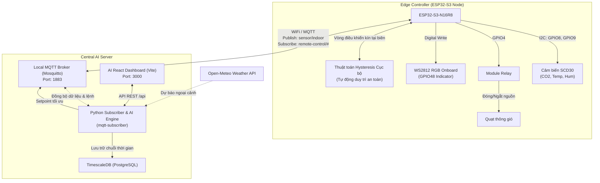

# Hệ thống Điều khiển HVAC và Tối ưu hóa Năng lượng tích hợp AI (Edge-to-Central DRL)

### Dự án nghiên cứu phát triển hệ thống điều khiển vi khí hậu và chất lượng không khí tòa nhà dựa trên kiến trúc phân tán Edge-to-Central (ESP32-S3 & Docker Server)

---

## 1. Sơ đồ kiến trúc Phân tầng (System Architecture)

Hệ thống hoạt động theo mô hình **Hierarchical Control (Điều khiển phân tầng)**:
*   **Edge Node (ESP32-S3):** Thu thập dữ liệu từ cảm biến chất lượng không khí **Sensirion SCD30** (đo CO2, Nhiệt độ, Độ ẩm), điều khiển quạt thông gió qua **Module Relay**, chỉ thị trạng thái bằng **LED** và duy trì vòng điều khiển cục bộ an toàn (**Fail-safe**) dựa trên các ngưỡng dự phòng khi mất kết nối.
*   **Central Server (Docker Server):** Đóng vai trò là **AI Zone Manager** chạy trên nền tảng Docker, lưu trữ dữ liệu chuỗi thời gian vào **TimescaleDB**, chạy mô hình dự báo tối ưu **DRL (Deep Reinforcement Learning)** kết hợp thông tin thời tiết ngoài trời để tự động hiệu chỉnh tham số Setpoint cho ESP32 nhằm tối ưu năng lượng.



---

## 2. Mô hình tối ưu hóa DRL (Applied Energy 2025)

Dự án tích hợp mô hình tối ưu hóa đa mục tiêu dựa trên nghiên cứu:
> *Fangzhou Guo, Sang woo Ham, Donghun Kim, Hyeun Jun Moon. Deep reinforcement learning control for co-optimizing energy consumption, thermal comfort, and indoor air quality in an office building. Applied Energy, 2025.*

### A. Mô tả Bài toán & Simulator
Tác nhân học tăng cường liên tục tối ưu hóa hành vi điều khiển HVAC nhằm cân bằng 4 mục tiêu:
1.  **Tiêu thụ năng lượng (Energy consumption)**
2.  **Tiện nghi nhiệt (Thermal comfort)** theo tiêu chuẩn ASHRAE-55
3.  **Chất lượng không khí (Indoor CO2 concentration)**
4.  **Nồng độ bụi mịn (Indoor PM2.5 concentration)**

### B. Kết quả Tái hiện & So sánh (Seoul Summer Weather - 7 Days)
Chúng ta đã lập trình kiểm thử tự động so sánh tác nhân **DRL (DDPG)** với bộ điều khiển **Rule-Based Control (RBC)** truyền thống và **Random Policy**:

| Chỉ số Đánh giá | DRL (Tác nhân AI) | RBC (Baseline) | Random Policy |
| :--- | :---: | :---: | :---: |
| **Nhiệt độ phòng TB ($^\circ$C)** | **23.27** | 19.25 (Quá lạnh) | 18.97 (Quá lạnh) |
| **Độ ẩm tương đối TB (%)** | 2.0% | 1.4% | 4.4% |
| **Nồng độ $CO_2$ TB (ppm)** | 870 | 583 | 499 |
| **Nồng độ $PM_{2.5}$ TB ($\mu$g/m$^3$)** | 1.57 | 2.54 | 5.78 |
| **Điện năng tiêu thụ (kWh/ngày)** | **21.088** | 31.768 | 38.647 |
| **Reward trung bình / bước** | **-0.345** | -6.038 | -6.823 |
| **Tỷ lệ vi phạm nhiệt độ** | **14.6%** | 88.4% | 89.6% |
| **Tỷ lệ vi phạm $CO_2$** | 7.6% | 0.0% | 0.3% |
| **Tỷ lệ vi phạm $PM_{2.5}$** | 0.7% | 2.5% | 18.3% |

**Nhận xét:**
*   **Tiết kiệm điện:** Tác nhân DRL tiết kiệm tới **33.62%** điện năng so với bộ điều khiển luật tĩnh (RBC) và **45.44%** so với chạy ngẫu nhiên.
*   **Bảo vệ sức khỏe và tiện nghi:** Giữ phòng luôn mát mẻ dễ chịu ở mức $23.27^\circ\text{C}$ và lọc sạch các hạt chất ô nhiễm dưới ngưỡng nguy hại.

---

## 3. Sơ đồ kết nối phần cứng (Wiring Diagram)

### A. Cảm biến SCD30 với ESP32-S3 (Giao tiếp I2C)
| Chân SCD30 | Chân ESP32-S3 | Chức năng | Màu dây khuyến nghị |
| :--- | :--- | :--- | :--- |
| **VIN** | **3V3** | Nguồn 3.3V | Đỏ |
| **GND** | **GND** | Đất chung | Đen |
| **SDA** | **GPIO8** | Dữ liệu I2C SDA | Vàng |
| **SCL** | **GPIO9** | Xung nhịp I2C SCL | Cam |

### B. Module Relay với ESP32-S3
| Chân Relay | Chân ESP32-S3 / Nguồn | Chức năng |
| :--- | :--- | :--- |
| **VCC** | **5V** | Nguồn cuộn hút Relay |
| **GND** | **GND** | Đất chung |
| **IN1** | **GPIO4** | Tín hiệu điều khiển quạt (Kích mức HIGH) |

### C. Đấu nối nguồn Quạt thông gió với Relay
```text
[ Nguồn Quạt - ] ───────────────────────────> [ Quạt - ] (Nối trực tiếp)

[ Nguồn Quạt + ] ────────> [ Cổng COM ]
                            [ Cổng NO  ] ───> [ Quạt + ]
```

---

## 4. Hướng dẫn Triển khai phần mềm

### Bước 1: Nạp Firmware ESP32
Mở tệp `HVAC_Control.ino` bằng **Arduino IDE**, cấu hình các thông số:
```cpp
#define WIFI_SSID        "WiFi_2.4G_Name"      // Chỉ hỗ trợ băng tần 2.4GHz
#define WIFI_PASSWORD    "WiFi_Password"
#define MQTT_SERVER      "IP_Server_Cua_Ban"   // Trỏ về địa chỉ IP Server Docker
#define MQTT_PORT        1883
#define MQTT_DEVICE_ID   "indoor-01"
```
Chọn board **`ESP32S3 Dev Module`** và nạp chương trình.

### Bước 2: Khởi chạy docker compose trên Server
```bash
docker compose up -d --build
```
Lệnh này khởi dựng cụm dịch vụ:
*   `mosquitto` (MQTT Broker - Port 1883)
*   `timescaledb` (TimescaleDB - Port 5432)
*   `mqtt-subscriber` (AI Engine - Port 5000)
*   `smart_hvac-app` (Web UI Dashboard - Port 3000)

### Bước 3: Chạy mô phỏng đánh giá tự động
Để kiểm tra lại hiệu năng DRL và Baseline trên máy chủ:
```bash
python replicate_and_compare.py
```

---

## 5. Tác giả
*   **Trần Đạt** (GitHub: [trandat09062003](https://github.com/trandat09062003))
