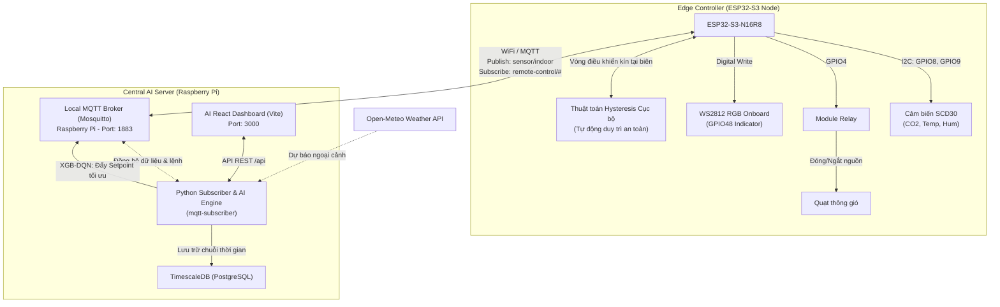

# Hệ thống Điều khiển HVAC và Tối ưu hóa Năng lượng tích hợp AI (XGB-DQN)

### Đồ án nghiên cứu phát triển hệ thống điều khiển vi khí hậu tòa nhà dựa trên kiến trúc phân tán Edge-to-Central (ESP32-S3 và Raspberry Pi)

Dự án xây dựng hệ thống điều khiển thông gió và điều hòa không khí (HVAC) quy mô phòng học/văn phòng. Hệ thống hoạt động theo mô hình **Hierarchical Control (Điều khiển phân tầng)**:
* **Edge Node (ESP32-S3):** Thu thập dữ liệu từ cảm biến chất lượng không khí **Sensirion SCD30** (đo CO2, Nhiệt độ, Độ ẩm), điều khiển quạt thông gió qua **Module Relay**, chỉ thị trạng thái bằng **LED** và duy trì vòng điều khiển cục bộ an toàn (**Fail-safe**) dựa trên các ngưỡng dự phòng khi mất kết nối.
* **Central Server (Raspberry Pi):** Đóng vai trò là **AI Zone Manager** chạy trên nền tảng Docker, lưu trữ dữ liệu chuỗi thời gian vào **TimescaleDB**, chạy mô hình dự báo **XGB-DQN** kết hợp thông tin thời tiết ngoài trời để tự động hiệu chỉnh tham số Setpoint cho ESP32 nhằm tối ưu năng lượng.

---

## 1. Sơ đồ kiến trúc Phân tầng (System Architecture)

Kiến trúc phối hợp giữa server Raspberry Pi và Edge Node ESP32-S3:



---

## 2. Các chức năng của AI Zone Manager trên Pi

Để đảm bảo tính liên tục của hệ thống khi mất mạng, ESP32-S3 tự động duy trì vòng lặp điều khiển độc lập tại biên. Raspberry Pi đóng vai trò bộ điều phối trung tâm gửi các tham số thiết lập tối ưu:

### A. Quản lý chính sách theo lịch trình (Zone Policy Engine)
Tự động điều chỉnh các ngưỡng hoạt động theo thời gian thực trên Pi:
* **Giờ làm việc (08:00 - 17:00):** Duy trì nhiệt độ thoải mái ($24.5^\circ\text{C}$), khống chế nồng độ CO2 dưới mức $700\text{ ppm}$ để đảm bảo không khí thông thoáng.
* **Chế độ ngủ đêm ECO (22:00 - 06:00):** Tăng nhiệt độ lên $26.5^\circ\text{C}$ để tiết kiệm điện, cấu hình quạt chạy tốc độ thấp, nâng ngưỡng CO2 lên $950\text{ ppm}$ giảm thiểu ồn.
* **Chế độ chờ (Eco Standby):** Ngoài giờ làm việc, ngắt điều hòa và nâng ngưỡng an toàn thông gió lên tối đa ($1200\text{ ppm}$ / $75\%$) để đưa phòng về trạng thái tiết kiệm điện năng tối đa.

### B. Thuật toán làm mát tự nhiên (Free Cooling)
* Server liên tục cập nhật nhiệt độ ngoài trời từ API thời tiết (Open-Meteo).
* Nếu nhiệt độ ngoài trời mát hơn nhiệt độ phòng hiện tại $> 1.5^\circ\text{C}$, hệ thống sẽ ưu tiên làm mát tự nhiên.
* Pi gửi lệnh tăng setpoint AC lên $28^\circ\text{C}$ (giảm tải máy nén) và điều khiển quạt thông gió chạy hết công suất, đồng thời khuyến nghị trên giao diện người dùng mở cửa sổ để đón gió tự nhiên.

### C. Cơ chế ghi đè thủ công (Manual Override)
* Khi người dùng thay đổi thông số trực tiếp trên Dashboard, Pi sẽ tạm dừng kiểm soát của AI trong vòng **15 phút**.
* Hệ thống hiển thị đếm ngược trạng thái `OVERRIDE`. Sau 15 phút, quyền điều khiển tự động được hoàn trả cho AI.

### D. Thuật toán mô phỏng điện năng thực tế & So sánh Baseline
Để đánh giá hiệu quả năng lượng của thuật toán AI, server thực hiện tính toán thermodynamic và đối chiếu song song với hệ thống điều khiển Baseline truyền thống:
* **Phân rã tiêu thụ (AI Power Breakdown):**
  * *Điều hòa (AC Unit):* Mô phỏng công suất tức thời dựa trên tải nhiệt: `0W` (chờ), `12W` (quạt gió), `150W` (inverter duy trì), lên đến `1400W` (máy nén hoạt động tối đa).
  * *Quạt thông gió:* `45W` khi hoạt động.
  * *Hệ thống:* `5W` standby.
* **Hệ thống đối chứng Baseline (Traditional Setup):** Mô phỏng phòng vận hành thủ công thông thường:
  * Máy lạnh hoạt động liên tục 24/7 cố định ở mức `24.0°C` (không có chế độ ngủ đêm hay standby).
  * Quạt thông gió bật liên tục 100% thời gian (`45W`).
* **Tính toán tỷ lệ tiết kiệm năng lượng:**
  $$\% \text{ Tiết kiệm} = \frac{E_{baseline} - E_{AI}}{E_{baseline}} \times 100\%$$
* **Quy đổi chi phí (VNĐ) & phát thải CO2:** Quy đổi năng lượng tiết kiệm được ra chi phí tiền điện thực tế tại Việt Nam (~`2500 VNĐ / kWh`) và lượng giảm phát thải khí nhà kính (`1 kWh ~ 0.5 kg CO2`).

---

## 3. Giao diện điều phối năng lượng & Dashboard

Giao diện Dashboard (React + Vite) tập trung trực quan hóa các dữ liệu tối ưu hóa năng lượng:
1. **Biểu đồ công suất tiêu thụ:** Area Chart cỡ lớn hiển thị song song công suất thực tế tối ưu hóa bởi AI (W) và công suất đối chứng Baseline (W) theo chu kỳ thời gian thực.
2. **Khung phân tích hiệu quả:** Hiển thị Badge chỉ số tiết kiệm tích lũy (%), số tiền điện tiết kiệm được (VNĐ) và khối lượng phát thải CO2 đã giảm thiểu.
3. **Mô phỏng tức thời:** Hiển thị công suất hiện tại của hệ thống cùng biểu đồ Sparkline mini lưu trữ lịch sử tải điện của 7 chu kỳ gần nhất.
4. **Ngưỡng tự động AI:** Hiển thị trạng thái các ngưỡng an toàn về CO2 và độ ẩm được thiết lập tự động bởi thuật toán, loại bỏ các nút điều khiển thủ công dư thừa.

---

## 4. Sơ đồ kết nối phần cứng (Wiring Diagram)

> [!IMPORTANT]
> Hãy ngắt nguồn điện cấp cho ESP32-S3 trước khi đấu nối để tránh hỏng hóc linh kiện.

### A. Cảm biến SCD30 với ESP32-S3 (Giao tiếp I2C)
| Chân SCD30 | Chân ESP32-S3 | Chức năng | Màu dây khuyến nghị |
| :--- | :--- | :--- | :--- |
| **VIN** | **3V3** | Nguồn 3.3V | Đỏ |
| **GND** | **GND** | Đất chung | Đen |
| **SDA** | **GPIO8** | Dữ liệu I2C SDA | Vàng |
| **SCL** | **GPIO9** | Xung nhịp I2C SCL | Cam |

### B. Module Relay với ESP32-S3
| Chân Relay | Chân ESP32-S3 / Nguồn | Chức năng |
| :--- | :--- | :--- |
| **VCC** | **5V** | Nguồn cuộn hút Relay |
| **GND** | **GND** | Đất chung |
| **IN1** | **GPIO4** | Tín hiệu điều khiển quạt (Kích mức HIGH) |

### C. Đấu nối nguồn Quạt thông gió với Relay
Đấu nối tiếp điểm cơ học của Relay để đóng cắt thiết bị tải:
* Dây **Âm (-)** của nguồn quạt $\rightarrow$ Nối **trực tiếp** vào dây **Âm (-)** của Quạt.
* Dây **Dương (+)** của nguồn quạt $\rightarrow$ Nối vào chân **COM** của Relay.
* Chân **NO** của Relay $\rightarrow$ Nối vào dây **Dương (+)** của Quạt.
```text
[ Nguồn Quạt - ] ───────────────────────────> [ Quạt - ] (Nối trực tiếp)

[ Nguồn Quạt + ] ────────> [ Cổng COM ]
                            [ Cổng NO  ] ───> [ Quạt + ]
```

---

## 5. Nạp Firmware ESP32 & Cấu hình mạng

> [!WARNING]  
> Mạch **ESP32-S3** chỉ hỗ trợ Wi-Fi băng tần **2.4GHz** (802.11 b/g/n). Thiết bị không thể quét thấy hoặc kết nối tới các điểm phát Wi-Fi **5GHz**. Vui lòng cấu hình `WIFI_SSID` chính xác sang băng tần 2.4GHz.

Mở tệp `HVAC_Control.ino` bằng **Arduino IDE**:
1. **Cấu hình mạng Wi-Fi:**
   ```cpp
   #define WIFI_SSID        "Ten_WiFi_2.4G"      // SSID mạng Wi-Fi 2.4GHz
   #define WIFI_PASSWORD    "Mat_Khau_WiFi"      // Mật khẩu Wi-Fi
   ```
2. **Cấu hình máy chủ MQTT:**
   Trỏ địa chỉ máy chủ MQTT về IP tĩnh của Raspberry Pi trong mạng nội bộ:
   ```cpp
   #define MQTT_SERVER      "192.168.1.10"       // Địa chỉ IP của Raspberry Pi
   #define MQTT_PORT        1883                 // Cổng MQTT mặc định
   #define MQTT_DEVICE_ID   "indoor-01"          // ID thiết bị
   ```
3. **Nạp Firmware:**
   * Kết nối cổng USB của ESP32-S3 vào máy tính.
   * Chọn đúng COM Port và Board tương ứng trong Arduino IDE là **`ESP32S3 Dev Module`**.
   * Nhấn nút **Upload** để nạp chương trình.
   * Mở Serial Monitor với tốc độ baud **`115200`** để giám sát logs kết nối.

---

## 6. Triển khai trên Raspberry Pi (Central Server)

Các dịch vụ trên Pi được đóng gói hoàn toàn bằng Docker Compose để đơn giản hóa quá trình cài đặt:

### Bước 1: Cài đặt Docker trên Raspberry Pi
```bash
curl -sSL https://get.docker.com | sh
sudo usermod -aG docker $USER
sudo reboot
```

### Bước 2: Tắt Mosquitto mặc định trên OS (tránh xung đột cổng 1883)
```bash
sudo systemctl stop mosquitto
sudo systemctl disable mosquitto
```

### Bước 3: Khởi chạy cụm dịch vụ Docker Compose
Truy cập vào thư mục chứa mã nguồn dự án (`Smart_HVAC`) và chạy lệnh:
```bash
sudo docker compose up -d --build
```
Lệnh này sẽ tự động khởi dựng và chạy ngầm 4 container dịch vụ:
* `mosquitto` (MQTT Broker - Port 1883)
* `timescaledb` (TimescaleDB lưu trữ chuỗi thời gian - Port 5432)
* `mqtt-subscriber` (Bộ điều khiển AI và API Python - Port 5000)
* `smart_hvac-app-1` (Web UI React Dashboard - Port 3000)

### Bước 4: Giám sát logs hoạt động của AI Engine
```bash
sudo docker logs -f mqtt-subscriber
```

---

## 7. Truy cập và Vận hành Dashboard

* **Sử dụng IP của Pi:** Để điều khiển thiết bị phần cứng thực tế hoạt động, bạn bắt buộc phải truy cập Dashboard qua địa chỉ IP nội bộ của Raspberry Pi trong mạng LAN (không truy cập qua localhost trên máy tính cá nhân):
  `http://192.168.1.10:3000` *(Thay bằng IP thực tế của Pi).*
* **Xóa cache trình duyệt:** Nhấn **`Ctrl + F5`** khi mở trang lần đầu tiên để đảm bảo trình duyệt cập nhật đúng giao diện và các biểu đồ so sánh công suất mới nhất.

---

<<<<<<< HEAD
=======
## 8. Xử lý sự cố thường gặp (Troubleshooting)

### Lỗi 1: `Bind for 0.0.0.0:1883 failed: port is already allocated`
* **Khắc phục:** Chạy lệnh `sudo systemctl stop mosquitto` trên Pi để giải phóng cổng 1883 cho Docker Container.

### Lỗi 2: Trị số tích lũy năng lượng hiển thị sai lệch lớn ngay khi khởi chạy
* **Khắc phục:** Reset dữ liệu tích lũy về 0 để hai hệ thống bắt đầu đồng bộ thời điểm:
  `sudo docker exec -i timescaledb psql -U admin -d iotdb -c "UPDATE sensor_data SET energy_kwh = 0.0, energy_base_kwh = 0.0;"`

### Lỗi 3: ESP32 không thể kết nối tới MQTT Broker trên Pi
* **Khắc phục:**
  1. Đảm bảo ESP32 và Raspberry Pi cùng kết nối chung một lớp mạng nội bộ.
  2. Cho phép truy cập cổng 1883 trên tường lửa của Pi: `sudo ufw allow 1883/tcp`.
>>>>>>> 89a4ccc (Refactor README.md to clean developer/academic documentation style)
