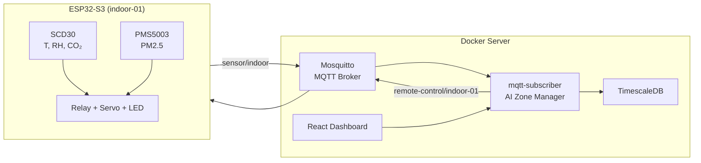

# AI HVAC Control — Hệ thống điều khiển HVAC thông minh (IoT + Deep RL)

Dự án triển khai **điều khiển HVAC tầng trung tâm** kết hợp **ESP32-S3** (edge), **MQTT + TimescaleDB** (server), **Dashboard React** (giám sát) và **AI Zone Manager** dùng thuật toán **DDPG** (Deep Deterministic Policy Gradient) theo phương pháp bài báo Applied Energy 2025.

Mục tiêu: đồng thời tối ưu **tiêu thụ năng lượng**, **tiện nghi nhiệt**, **nồng độ CO₂** và **PM₂.₅** trong phòng làm việc.

---

## Mục lục

1. [Tổng quan sản phẩm](#1-tổng-quan-sản-phẩm)
2. [Kiến trúc hệ thống](#2-kiến-trúc-hệ-thống)
3. [Phần cứng](#3-phần-cứng)
4. [Cấu trúc thư mục](#4-cấu-trúc-thư-mục)
5. [Model AI — Đánh giá chi tiết](#5-model-ai--đánh-giá-chi-tiết)
6. [Tạo model (Training)](#6-tạo-model-training)
7. [Sử dụng model (Deployment)](#7-sử-dụng-model-deployment)
8. [Hướng dẫn triển khai từ đầu đến cuối](#8-hướng-dẫn-triển-khai-từ-đầu-đến-cuối)
9. [Docker và cổng mạng](#9-docker-và-cổng-mạng)
10. [Dashboard và API](#10-dashboard-và-api)
11. [Xử lý sự cố](#11-xử-lý-sự-cố)
12. [Tài liệu tham khảo](#12-tài-liệu-tham-khảo)

---

## 1. Tổng quan sản phẩm

### Luồng vận hành



### Hai lớp điều khiển

| Lớp | Vị trí | Vai trò |
|-----|--------|---------|
| **AI Zone Manager** | `server/mqtt-subscriber/subscriber.py` | Nhận telemetry, chạy inference DDPG, gửi setpoint (nhiệt độ, quạt, van, ngưỡng CO₂/RH) |
| **Firmware cục bộ** | `esp32/HVAC_Control.ino` | Thực thi relay/servo, rule bảo vệ khi mất MQTT, LED trạng thái |

Nếu không load được model, hệ thống **tự động fallback** sang điều khiển rule-based theo khung giờ (giờ làm việc / đêm ECO / chờ tiết kiệm).

---

## 2. Kiến trúc hệ thống

### Stack phần mềm

| Thành phần | Công nghệ |
|------------|-----------|
| Firmware | Arduino IDE, ESP32-S3, PubSubClient |
| Broker | Eclipse Mosquitto |
| Backend | Python 3.11, paho-mqtt, psycopg2, NumPy |
| Database | TimescaleDB (PostgreSQL) |
| Frontend | React, Vite, TypeScript, Tailwind |
| AI Training | Python 3.12+, TensorFlow 2.x, Matplotlib |
| Container | Docker Compose |

### Topic MQTT chính

| Topic | Hướng | Nội dung |
|-------|-------|----------|
| `sensor/indoor` | ESP32 → Server | JSON: `temperature`, `humidity`, `co2`, `dust`, `device_id` |
| `remote-control/{device_id}` | Server → ESP32 | JSON: `power`, `temp`, `operation_mode`, `fan_power`, `co2_max`, `humidity_max`, `damper_ratio` |

---

## 3. Phần cứng

### Linh kiện

| Thành phần | Chức năng |
|------------|-----------|
| ESP32-S3-N16R8 | Vi điều khiển chính |
| Sensirion SCD30 | Nhiệt độ, độ ẩm, CO₂ (I²C) |
| PMS5003 | PM₂.₅ (UART) |
| Relay module | Bật/tắt quạt thông gió |
| Servo | Góc mở van thông gió (0–90°) |
| WS2812 RGB (tùy chọn) | LED trạng thái hệ thống |

### Sơ đồ chân (ESP32)

| Thiết bị | GPIO |
|----------|------|
| SCD30 SDA / SCL | GPIO8 / GPIO9 |
| Relay quạt | GPIO4 |
| Servo van | GPIO15 |
| PMS5003 RX / TX | GPIO17 / GPIO16 |
| WS2812 RGB | GPIO48 |

Chi tiết thiết kế PCB: `docs/hardware_design_guide.md`

---

## 4. Cấu trúc thư mục

```text
AI_HVAC_Control/
├── esp32/HVAC_Control.ino        # Firmware ESP32
├── server/mqtt-subscriber/
│   ├── subscriber.py             # AI Zone Manager + MQTT + REST API
│   ├── load_model.py             # Export .h5 → .npz
│   ├── actor_weights.npz         # Model runtime (inference NumPy)
│   └── Dockerfile
├── paper_reference/
│   ├── checkpoints_v2/           # Model train: actor.weights.h5, critic.weights.h5
│   ├── drl/                      # DDPG agent, networks, replay buffer
│   ├── simulator/                # Hybrid simulator
│   ├── data/                     # Weather generator
│   ├── train.py                  # Script train
│   └── evaluate.py               # Đánh giá
├── scripts/replicate_and_compare.py  # Benchmark DRL vs RBC vs Random
├── docs/                         # Tài liệu phần cứng, biểu đồ so sánh
├── src/                          # Dashboard React
├── libraries/                    # Thư viện Arduino
├── tests/                        # Test phần cứng
├── mosquitto/                    # Cấu hình MQTT broker
├── docker-compose.yml            # Cổng 3000 / 1883
└── docker-compose.alt.yml        # Cổng 3005 / 1885
```

---

## 5. Model AI — Đánh giá chi tiết

### 5.1 Model đã tải là gì?

Model hiện tại là **DDPG Agent v2** — bộ **Actor–Critic** deep reinforcement learning, huấn luyện trên **Hybrid Simulator** mô phỏng phòng văn phòng theo bài báo:

> Fangzhou Guo, Sang Woo Ham, Donghun Kim, Hyeun Jun Moon. *Deep reinforcement learning control for co-optimising energy consumption, thermal comfort, and indoor air quality in an office building.* Applied Energy, 2025. [DOI: 10.1016/j.apenergy.2024.124467](https://doi.org/10.1016/j.apenergy.2024.124467)

**Bản sao model** (Google Drive, cập nhật 06/2026):  
[https://drive.google.com/drive/folders/1Z_hq9zdndvTVatvJ3bc4qA17vJzMEJJC](https://drive.google.com/drive/folders/1Z_hq9zdndvTVatvJ3bc4qA17vJzMEJJC)

### 5.2 Kiến trúc mạng

**State (10 chiều)** — vector chuẩn hóa Min–Max trước khi đưa vào Actor:

| Index | Biến | Ý nghĩa | Min | Max |
|-------|------|---------|-----|-----|
| 0 | hour | Giờ trong ngày | 0 | 24 |
| 1 | T_oa | Nhiệt độ ngoài trời (°C) | −5 | 40 |
| 2 | ω_oa | Độ ẩm tuyệt đối ngoài trời | 0.002 | 0.025 |
| 3 | q_sol | Tải nhiệt mặt trời (W) | 0 | 900 |
| 4 | — | Cố định 450 | 390 | 510 |
| 5 | PM_out | PM₂.₅ ngoài trời | 0 | 80 |
| 6 | T_za | Nhiệt độ trong phòng (°C) | 15 | 35 |
| 7 | ω_za | Độ ẩm tuyệt đối trong phòng | 0.003 | 0.022 |
| 8 | CO₂ | Nồng độ CO₂ (ppm) | 400 | 2000 |
| 9 | PM_in | PM₂.₅ trong phòng | 0 | 50 |

**Action (4 chiều)** — đầu ra Actor (tanh → [−1, 1], map sang [0, 1]):

| Index | Biến điều khiển | Phạm vi thực |
|-------|-----------------|--------------|
| 0 | T_chws | Nước lạnh 5–15 °C (ban ngày) |
| 1 | D_oa | Van gió tươi 20–100% |
| 2 | f_sa | Tốc độ quạt 10–100% |
| 3 | P_air | Máy lọc không khí ON/OFF |

**Actor network:** `Input(10) → Dense(256, ReLU) → Dense(256, ReLU) → Dense(4, tanh)`

**Critic network:** Nhánh state (16→32) + nhánh action (32) → Concat → Dense(256)×2 → Q-value

**Cải tiến v2 so với v1** (`paper_reference/drl/ddpg_agent.py`):

- Gradient clipping (norm = 1.0)
- Warm-up: chỉ train sau ≥ 10.000 mẫu trong replay buffer
- Critic cập nhật 2×/bước, Actor 1×/bước (kiểu TD3)
- Clip reward vào [−20, 0] trước khi lưu buffer

**Hyperparameters** (theo Table 6 bài báo):

| Tham số | Giá trị |
|---------|---------|
| γ (discount) | 0.98 |
| τ (soft update) | 0.005 |
| lr_actor | 2.5×10⁻⁵ |
| lr_critic | 5×10⁻⁵ |
| batch_size | 128 |
| replay buffer | 1.500.000 mẫu |
| OU noise | θ=0.15, σ=0.2 |

### 5.3 File model

| File | Kích thước | Mục đích |
|------|------------|----------|
| `paper_reference/checkpoints_v2/actor.weights.h5` | ~296 KB | Trọng số Actor (Keras/TensorFlow) — dùng train/eval |
| `paper_reference/checkpoints_v2/critic.weights.h5` | ~365 KB | Trọng số Critic — chỉ cần khi train tiếp |
| `server/mqtt-subscriber/actor_weights.npz` | ~280 KB | Trọng số Actor dạng NumPy — **dùng khi chạy server** |

Cấu trúc `actor_weights.npz`:

```
w_z1:     (10, 256)
b_z1:     (256,)
w_z2:     (256, 256)
b_z2:     (256,)
w_action: (256, 4)
b_action: (4,)
```

Server **không cần TensorFlow** lúc runtime — chỉ forward pass NumPy trong `subscriber.py`.

### 5.4 Kết quả đánh giá (mô phỏng 7 ngày, tháng 7 Seoul)

Chạy benchmark trên model đã tải (`checkpoints_v2`) so với **RBC** (rule-based baseline bài báo) và **Random**:

| Chỉ số | DRL (đã train) | RBC | Random |
|--------|:--------------:|:---:|:------:|
| Nhiệt độ TB (°C) | 25.5 | 19.2 | 19.0 |
| CO₂ TB (ppm) | 570 | 583 | 499 |
| PM₂.₅ TB (µg/m³) | 3.3 | 2.5 | 5.8 |
| **Năng lượng (kWh/ngày)** | **17.85** | 31.77 | 38.65 |
| Reward TB / bước | **−3.50** | −6.04 | −6.82 |
| Vi phạm nhiệt độ (%) | 62.2 | 88.4 | 89.6 |
| Vi phạm CO₂ ≥ 1000 ppm (%) | **0.0** | 0.0 | 0.3 |
| Vi phạm PM₂.₅ ≥ 10 (%) | 7.0 | 2.5 | 18.3 |

**Kết luận đánh giá:**

- **Tiết kiệm năng lượng:** DRL giảm **~44%** năng lượng so với RBC và **~54%** so với Random trong môi trường mô phỏng.
- **Chất lượng không khí:** CO₂ luôn dưới ngưỡng 1000 ppm; PM₂.₅ ở mức thấp.
- **Reward:** −3.50/bước tốt hơn đáng kể so với baseline v1 (~−13.5/bước trong `train.py`).
- **Hạn chế:** Mô phỏng dùng thời tiết Seoul mùa hè — nhiệt độ TB hơi cao so với dải tiện nghi 22–24.5 °C; khi triển khai thực tế tại Hà Nội cần **fine-tune** hoặc train lại với dữ liệu/local weather.

> Tái tạo báo cáo benchmark: `python scripts/replicate_and_compare.py` → `docs/comparison_results.md`

---

## 6. Tạo model (Training)

### 6.1 Môi trường mô phỏng

`paper_reference/simulator/hybrid_sim.py` tích hợp 5 mô hình (Fig. 5 bài báo):

1. **BuildingEnvelopeModel** — truyền nhiệt tường/phòng
2. **HumidityModel** — cân bằng ẩm
3. **CO2Model** — CO₂ trong phòng
4. **PM25Model** — bụi mịn PM₂.₅
5. **HVACRegressionModel** — luồng gió, nước lạnh, quạt

**Reward** (Eq. 15–20): phạt năng lượng + vi phạm nhiệt (22–24.5 °C) + RH > 60% + CO₂ ≥ 1000 ppm + PM₂.₅ ≥ 10 µg/m³ (ban ngày có người).

### 6.2 Cài đặt môi trường train

```powershell
cd "C:\Users\DELL\OneDrive - Hanoi University of Science and Technology\Desktop\AI_HVAC_Control"

pip install tensorflow numpy matplotlib
```

### 6.3 Chạy training

```powershell
cd paper_reference
python train.py
```

**Quá trình train (`train.py`):**

| Bước | Mô tả |
|------|-------|
| 1 | Khởi tạo `HybridSimulator`, `DDPGAgentV2`, `SeoulWeatherGenerator` |
| 2 | Mỗi episode: lặp 6 tháng (5–10) × 30 ngày × 96 bước (15 phút/bước) |
| 3 | Agent chọn action + OU noise → simulator trả reward → lưu replay buffer |
| 4 | Sau 10.000 mẫu: bắt đầu cập nhật Actor/Critic |
| 5 | Mỗi 5 episode: lưu `checkpoints_v2/actor.weights.h5` và `critic.weights.h5` |
| 6 | Kết thúc 5000 episode: vẽ `logs/training_curve_v2.png` |

```powershell
# Đánh giá nhanh 1 ngày
python evaluate.py

# Hoặc dùng notebook Colab
# paper_reference/train.ipynb
```

### 6.4 Sau khi train — chuẩn bị file cho server

```powershell
cd ..\server\mqtt-subscriber
python load_model.py
```

Script này:

1. Load `paper_reference/checkpoints_v2/` bằng TensorFlow
2. Trích trọng số 3 lớp Dense của Actor
3. Ghi `actor_weights.npz` cho subscriber

### 6.5 Train lại / fine-tune

- Giữ nguyên `STATE_MIN` / `STATE_MAX` nếu không đổi không gian trạng thái
- Có thể giảm `N_EPISODES` khi thử nghiệm (ví dụ 500), tăng lên 5000 cho bản production
- Thay `SeoulWeatherGenerator` bằng generator thời tiết Hà Nội nếu muốn thích nghi địa phương

---

## 7. Sử dụng model (Deployment)

### 7.1 Luồng inference trên server

```
Telemetry MQTT → ZoneManager.evaluate_and_control()
    → Xây dựng state vector 10 chiều từ cảm biến thực
    → Chuẩn hóa Min–Max
    → Forward pass NumPy (actor_weights.npz)
    → Map action → target_temp, fan_power, damper_ratio, co2_max
    → Publish remote-control/{device_id}
```

**Chính sách theo giờ** (`ZoneManager.get_scheduled_policy`):

| Khung giờ | Policy | Hành vi |
|-----------|--------|---------|
| 08:00–17:00 | `working_hours` | AI DDPG hoạt động |
| 22:00–06:00 | `night_eco` | AI DDPG hoạt động |
| Còn lại | `eco_standby` | Tắt nguồn, rule tiết kiệm |
| Manual override | `manual` | Giữ setpoint người dùng (Dashboard) |

**Map action → lệnh ESP32** (trích từ `subscriber.py`):

```python
a = (clip(action, -1, 1) + 1) / 2          # [0, 1]
T_chws = 5.0 + a[0] * 10.0                 # °C
target_temp = round(22.0 + (T_chws - 5) / 2, 1)
D_oa = 0.2 + a[1] * 0.8                    # 20–100%
f_sa = 0.1 + a[2] * 0.9                    # 10–100%
fan_on = (f_sa > 0.20) or (D_oa > 0.30)
```

Nếu load `actor_weights.npz` thất bại → **fallback rule-based** (free cooling, giờ làm việc, đêm ECO).

### 7.2 Cập nhật model mới

**Cách 1 — Từ Google Drive** (đã làm):

Tải 3 file vào đúng vị trí trong `paper_reference/checkpoints_v2/` và `server/mqtt-subscriber/`.

**Cách 2 — Sau train local:**

```powershell
python server\mqtt-subscriber\load_model.py
docker compose -p ai_hvac_control -f docker-compose.alt.yml build mqtt-subscriber
docker compose -p ai_hvac_control -f docker-compose.alt.yml up -d mqtt-subscriber
```

**Cách 3 — Kiểm tra model đã load:**

```powershell
docker logs ai-hvac-mqtt-subscriber --tail 20
```

Kỳ vọng thấy: `AI Zone Manager: Loaded DRL actor weights successfully!`

### 7.3 Firmware ESP32

Sửa trong `esp32/HVAC_Control.ino`:

```cpp
#define WIFI_SSID        "TenWiFi"
#define WIFI_PASSWORD    "MatKhau"
#define MQTT_SERVER      "192.168.x.x"   // IP máy chạy Docker
#define MQTT_PORT        1885            // alt compose; dùng 1883 nếu compose mặc định
#define MQTT_DEVICE_ID   "indoor-01"
```

Upload firmware qua Arduino IDE. ESP32 subscribe `remote-control/#` và áp dụng lệnh từ AI server; nếu mất mạng vẫn chạy rule cục bộ.

---

## 8. Hướng dẫn triển khai từ đầu đến cuối

### Bước 1 — Clone / mở project

```powershell
cd "C:\Users\DELL\OneDrive - Hanoi University of Science and Technology\Desktop\AI_HVAC_Control"
```

### Bước 2 — (Tùy chọn) Train hoặc dùng model có sẵn

- **Có sẵn:** `checkpoints_v2/` + `actor_weights.npz` (từ Drive hoặc đã train)
- **Train mới:** `cd paper_reference && python train.py` → `python ..\server\mqtt-subscriber\load_model.py`

### Bước 3 — Khởi động Docker

```powershell
# Chạy song song với HVAC_Control (không trùng cổng)
docker compose -p ai_hvac_control -f docker-compose.alt.yml up -d --build
```

### Bước 4 — Cấu hình & nạp firmware ESP32

- Sửa WiFi, IP broker, port MQTT
- Upload `esp32/HVAC_Control.ino`

### Bước 5 — Kiểm tra

1. Mở Dashboard: **http://localhost:3005**
2. Xem log subscriber: `docker logs ai-hvac-mqtt-subscriber -f`
3. Xác nhận ESP32 publish lên `sensor/indoor`
4. Dashboard hiển thị T, RH, CO₂, PM₂.₅ và trạng thái Zone Manager

### Bước 6 — Vận hành sản phẩm

- Giám sát realtime trên Dashboard
- Điều khiển thủ công qua Control Panel (override tạm thời)
- Dữ liệu lịch sử lưu TimescaleDB
- AI tự điều chỉnh theo khung giờ và telemetry

---

## 9. Docker và cổng mạng

| File compose | Dashboard | MQTT | Project name |
|--------------|-----------|------|--------------|
| `docker-compose.yml` | 3000 | 1883 | mặc định |
| `docker-compose.alt.yml` | **3005** | **1885** | `ai_hvac_control` |

Container AI_HVAC_Control:

| Container | Tên |
|-----------|-----|
| Dashboard | `ai_hvac_control-app-1` |
| MQTT Subscriber | `ai-hvac-mqtt-subscriber` |
| Mosquitto | `ai-hvac-mosquitto` |
| TimescaleDB | `ai-hvac-timescaledb` |

---

## 10. Dashboard và API

- **Dashboard:** biểu đồ realtime, metric cards, cảnh báo ngưỡng, bảng điều khiển từ xa
- **API telemetry:** subscriber expose port 5000 (trong Docker network)
- **Zone Manager info:** policy hiện tại, gợi ý AI, trạng thái override

Ngưỡng hiển thị (Dashboard):

| Thông số | Cảnh báo | Nguy hiểm |
|----------|----------|-----------|
| CO₂ | > 800 ppm | > 1000 ppm |
| PM₂.₅ | > 12 µg/m³ | > 35 µg/m³ |
| Nhiệt độ | < 18 hoặc > 26 °C | — |
| Độ ẩm | < 30% hoặc > 60% | — |

---

## 11. Xử lý sự cố

| Triệu chứng | Nguyên nhân | Cách xử lý |
|-------------|-------------|------------|
| `Failed to load DRL weights` | Thiếu `actor_weights.npz` hoặc chưa rebuild Docker | Chạy `load_model.py`, rebuild `mqtt-subscriber` |
| Dashboard không có dữ liệu | ESP32 chưa kết nối MQTT / sai IP | Kiểm tra `MQTT_SERVER`, port 1885, firewall |
| AI không chạy, chỉ rule | Policy `eco_standby` hoặc lỗi inference | Kiểm tra giờ hệ thống; xem log lỗi inference |
| `python train.py` not found | Sai thư mục | Chạy từ `paper_reference/` |
| Train OOM | TensorFlow trên CPU | Đóng app nặng; giảm batch hoặc dùng Colab notebook |

---

## 12. Tài liệu tham khảo

- Bài báo gốc: Guo et al., Applied Energy 2025 — DDPG HVAC co-optimization
- Code train/simulator: `paper_reference/`
- So sánh hiệu năng: `scripts/replicate_and_compare.py`
- Backup project + model: [Google Drive](https://drive.google.com/drive/folders/1Z_hq9zdndvTVatvJ3bc4qA17vJzMEJJC)

---

## License

MIT License (hoặc license bạn chọn cho repo).
